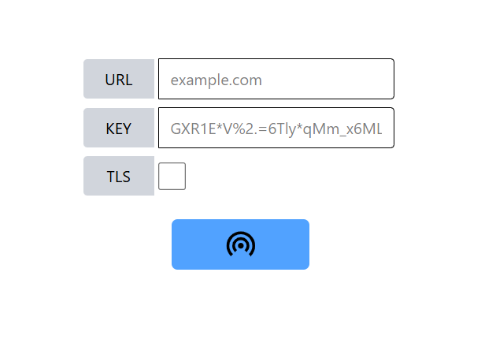

# MSPal


A music-sharing tool. Enjoy music together with your friends!

😄-🎵-🎵-🎵-😄

## Feature
- Synchronizes operations such as play, pause, and skip next.
- Low internet requirement

## The Client
You can download the client from [Release](https://github.com/revival0728/mspal/releases)

### User Guide
After downloading and installation, open the app `mspal client`



Enter the `URL` and `KEY` from the host.

The `TLS` stands for Transport Layer Security (encrypted network communication). If your host server enabled this feature, check it.

### Notice
- If you can't hear the music after joining the host, it may be because the previous playing media has not ended. You can fix it by clicking the skip-next button.

## The Host
You can download the host from [Release](https://github.com/revival0728/mspal/releases) or clone it from GitHub and use `deno` to run `deno task host`

### Setup
1. Install `ffmpeg` on the host machine
2. Create a directory `media/` and add media files. Currently, it only supports `.mp3`

### Usage
The host server only has CLI.

```
Commands:
  exit            :exit the mspal-host
  ping [status]   :test ping to all clients
  play            :play the media
  pause           :pause the media
  next            :skip current media
  status          :show the media status
  help [COMMAND]  :the command to show this text
If you want to see the help of specific command, use `help [COMMAND]`
```

The `port` and `KEY` will be displayed after running the host.

The `URL` given to the client **should not** contain `http`/`https`

### TLS Setup
If you are going to expose the host to the public network, it is recommended to enable `TLS`

To enable `TLS`, configure `CERT`/`CERT_PATH` and `KEY`/`KEY_PATH` in `.env`

### Configuration
The host can be configured using the `.env` file
```env
# port
PORT=3406

# TLS/SSL configuration
CERT="the certificate"
CERT_PATH="certificate path"

KEY="the private key"
KEY_PATH="private key path"
```

## TODO
- [ ] fix the initial fetching data slow issue
  - can be fixed by the user by clicking the play button
